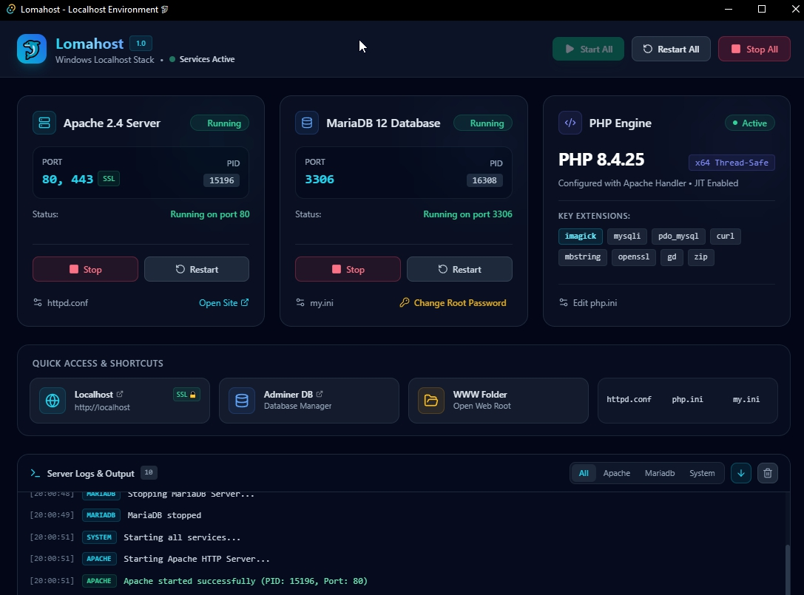

# LomaHost

Free portable localhost server for Windows — Apache 2.4, PHP 8.4, and MariaDB 12 bundled in one folder. Unzip, run, and start developing on `http://localhost` in seconds. No installer, no configuration, no system changes.

## Features

- **Portable** — no install, no admin rights required, just unzip and run
- **Apache 2.4 + PHP 8.4** — pre-configured and ready to serve your projects
- **MariaDB 12 + Adminer** — full MySQL-compatible database server with a built-in visual manager
- **One-click Start/Stop** — control Apache and MariaDB together from a single control panel
- **Any project folder** — point at any folder on your PC and serve it instantly
- **Editable config files** — full access to `php.ini`, `httpd.conf`, and `my.ini` for advanced tuning
- **Custom ports** — change Apache/MariaDB ports to avoid conflicts
- 100% free, no ads, no data collection
  

## System Requirements

Windows 10 or Windows 11 (64-bit). Apache 2.4, PHP 8.4, and MariaDB 12 are included — nothing else to install.

## Download
https://github.com/snagfiles/LomaHost/releases

## Installation

1. Download the ZIP
2. Extract the files to a folder of your choice
3. Run `LomaHost.exe` — Apache and MariaDB start automatically
4. Open `http://localhost` in your browser

## License

LomaHost is free to use. See License txt file in zip

---

Made in Bangkok by Suphan Sakulrat.
